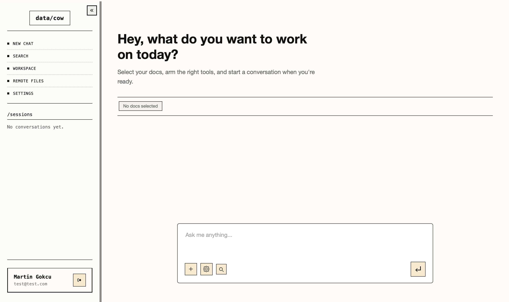
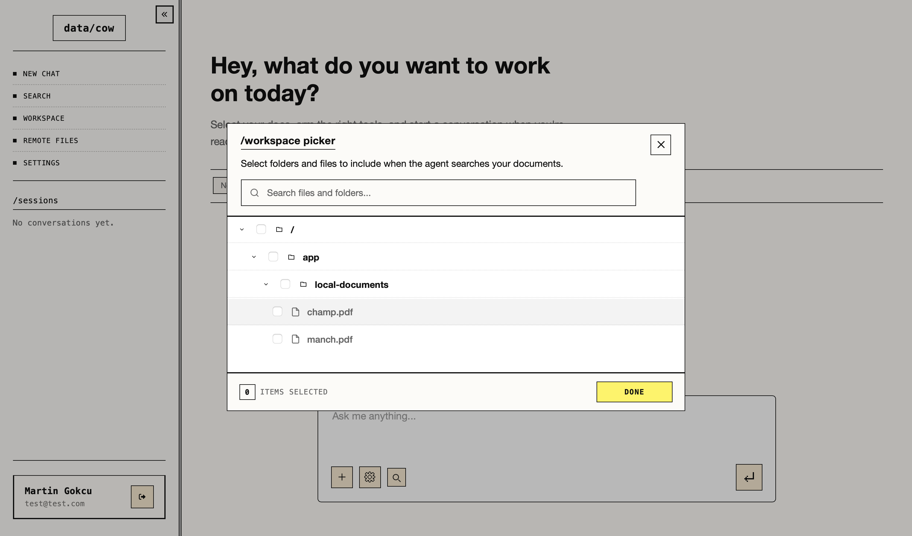
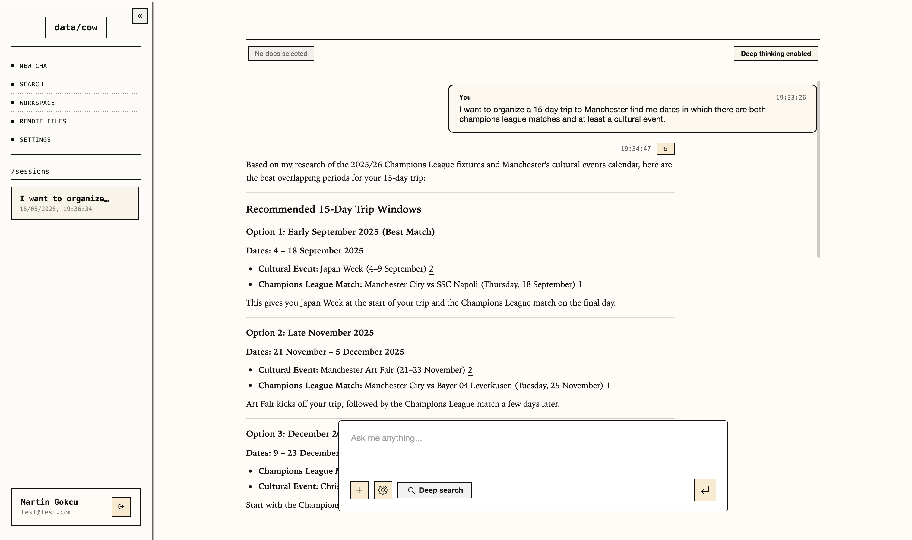
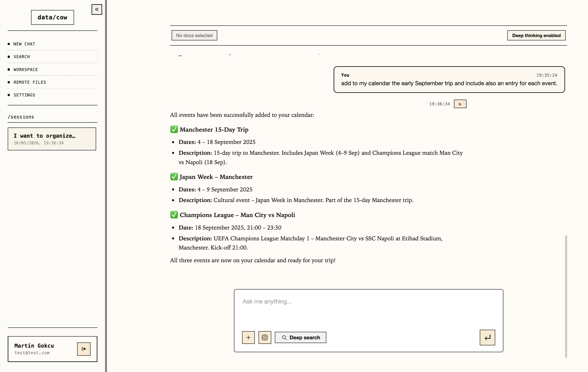
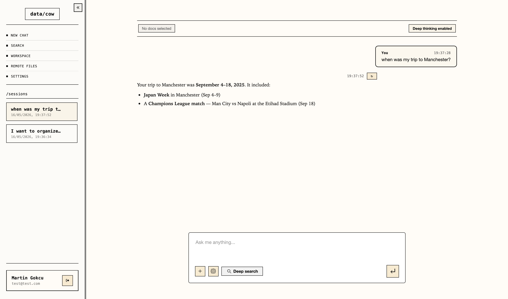
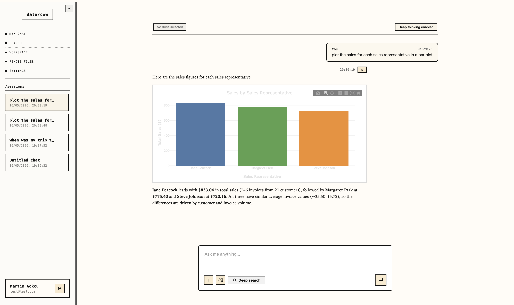
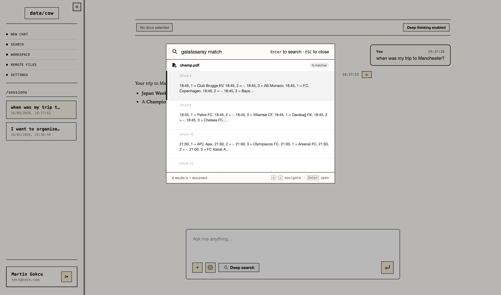
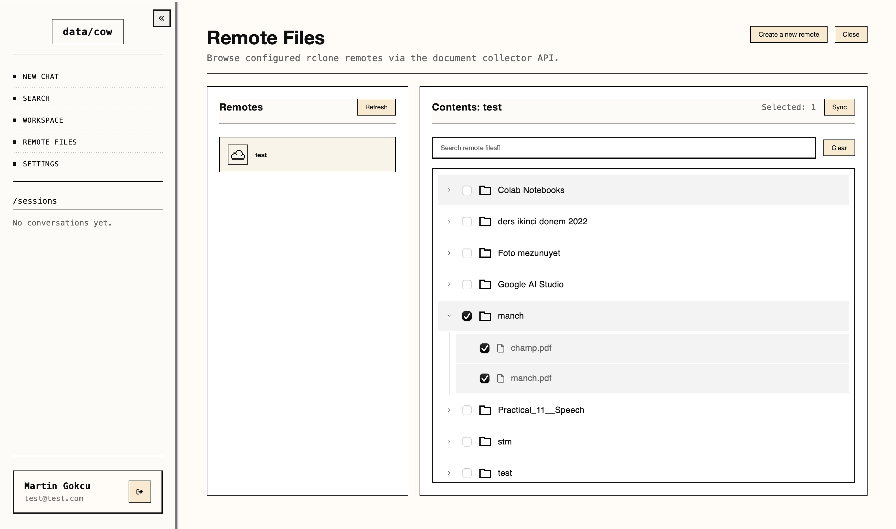
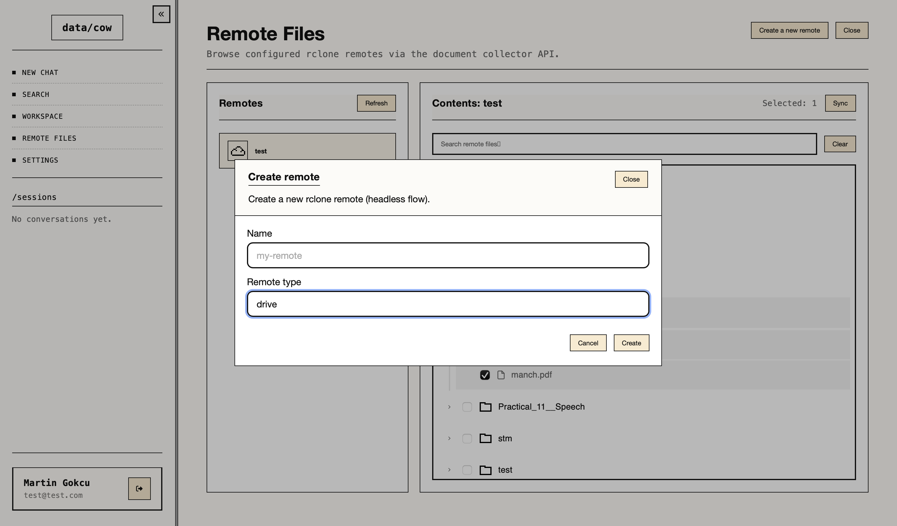
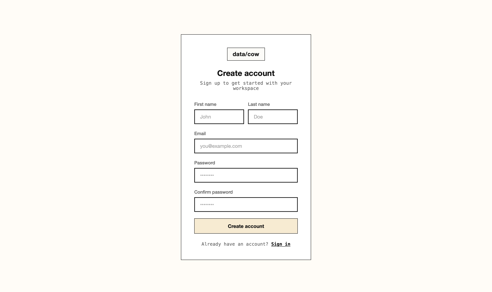

# iData

iData is a self-hosted enterprise document intelligence platform. Drop files into a watched folder or sync them from cloud storage, and the system automatically ingests, parses, chunks, and indexes them. A multi-agent RAG backend then answers natural-language questions about your documents with inline citations, SQL data lookups, and interactive graph generation — all through a React web interface. Tested locally using `qwen/qwen3.6-35b-a3b`.

---

## Screenshots

### Chat interface



### Workspace picker — select which documents or folders the agent can search



### Multi-source query — cross-referencing Champions League fixtures with Manchester cultural events to plan a trip



### Adding the planned trip to Google Calendar from the chat



### Retrieving a past calendar event in a new conversation



### SQL agent — querying structured data and rendering results as an interactive chart



### Spotlight search — semantic search across all parsed documents



### Remote Files — browse and select files to sync from a cloud remote



### Remote Files — add a new rclone remote (headless OAuth flow)



### Sign up / sign in



---

## Architecture

```
Drag & Drop          Remote Storage (Google Drive, S3, NAS…)
     │                        │
     │               User rclone Backend
     │                (host, port 13000)
     │                        │
     └────────────────────────┘
                  │
           local-documents/
                  │
                  ▼
        Document Collector ──(file events)──► MongoDB
        (Docker, watchdog)                   (document metadata)
                                                    │
                                                    ▼
                                       Document Parser Backend
                                       (Docling / Mistral OCR)
                                        │              │
                                        ▼              ▼
                                     Milvus         MongoDB
                                  (vector chunks)  (chunks + images)
                                             │
                                             ▼
                                   Agent Backend (Flask)
                              ┌──────────────────────────┐
                              │      Orchestrator Agent   │
                              │  ┌──────────────────────┐ │
                              │  │    Document Agent    │ │
                              │  │  (RAG + skills)      │ │
                              │  └──────────────────────┘ │
                              │  ┌──────────────────────┐ │
                              │  │      SQL Agent       │ │
                              │  │  (PostgreSQL)        │ │
                              │  └──────────────────────┘ │
                              └──────────────────────────┘
                                             │
                                             ▼
                                   Frontend (React + Vite)
```

**Pipeline:**
1. Files enter `local-documents/` by drag and drop, or by syncing from remote storage via the **User rclone Backend** running on the host.
2. **Document Collector** (Docker) detects new files via a filesystem watchdog and records their metadata in MongoDB.
3. **Document Parser Backend** picks up unprocessed files, parses them with Docling or Mistral OCR, chunks the content with LangChain HybridChunker, generates OpenAI embeddings, and writes chunks to Milvus and MongoDB.
4. **Agent Backend** receives chat messages and routes them through the **Orchestrator**, which delegates to a Document Agent and/or SQL Agent, then synthesizes a cited answer.
5. **Frontend** renders the response with markdown, images, inline citations, and interactive charts.

---

## Services

| Service | Port | Runs | Description |
|---|---|---|---|
| `agent_backend` | 5001 | Docker | Flask API + multi-agent orchestrator |
| `document_parser_backend` | 4999 | Docker | Document parsing worker |
| `document_collector` | 8001 | Docker | Folder watchdog |
| `frontend` | 3000 | Docker | React + TypeScript web interface |
| `mongodb` | 27017 | Docker | Document metadata + chunks + skills |
| `standalone` (Milvus) | 19530 | Docker | Vector database |
| `minio` | 9000 / 9001 | Docker | Object storage (Milvus dependency) |
| `postgres` | 5432 | Docker | User accounts + structured data |
| `pgadmin` | 5433 | Docker | PostgreSQL admin UI |
| `user_rclone_backend` | 13000 | **Local** | rclone sync API (must run on host) |

> `user_rclone_backend` must run directly on the host. rclone requires access to the host filesystem and browser-based OAuth flows that cannot work inside a container.

---

## Tech Stack

| Layer | Technologies |
|---|---|
| **Agent Framework** | LangGraph, DeepAgents, LangChain |
| **LLM / Embeddings** | OpenAI (GPT-4.1-mini, text-embedding), Mistral (OCR) |
| **Document Parsing** | Docling 2.61.1, Mistral OCR, LangChain HybridChunker |
| **Vector DB** | Milvus 2.6.5 + MinIO + etcd |
| **Databases** | MongoDB (documents, skills, chunks), PostgreSQL (users, structured data) |
| **Backend** | Flask (agent + parser), FastAPI (collector + rclone) |
| **Frontend** | React 18, TypeScript, Material-UI, Vite |
| **Cloud Sync** | rclone |
| **Containerization** | Docker Compose |

---

## Prerequisites

- Docker + Docker Compose
- Python 3.10+ (for `user_rclone_backend`)
- rclone installed on the host (for remote sync)
- An OpenAI API key (embeddings + LLM)
- A Mistral API key (required only for OCR-based PDF parsing)

---

## Setup

### 1. Configure environment

Copy `.env.example` to `.env` and fill in all values:

```bash
cp .env.example .env
```

Key variables to set:

| Variable | Description |
|---|---|
| `OPENAI_API_KEY` | OpenAI API key |
| `MISTRAL_API_KEY` | Mistral API key (OCR only) |
| `SECRET_KEY` | Random string for JWT signing — generate with `openssl rand -hex 32` |
| `MONGODB_USERNAME` / `MONGODB_PASSWORD` | MongoDB credentials |
| `POSTGRES_USER` / `POSTGRES_PASSWORD` | PostgreSQL credentials |
| `SQL_AGENTDB_URI` | Full PostgreSQL URI for the SQL agent |

### 2. Configure watched folders

Edit `configs/config.toml`:

```toml
[folder_paths]
nas_documents_path = "/app/local-documents"
local_documents_path = "/app/local-documents"
```

### 3. Start the Docker stack

```bash
docker compose up --build
```

Milvus takes ~30 seconds to initialize. The agent backend is ready when it logs `MongoDB connector initialized`.

### 4. Start the user rclone backend (local)

Required for remote storage sync. Run directly on the host:

```bash
cd user_rclone_backend
pip install -r requirements.txt   # first time only
python -m api.main
```

Starts on port `13000`.

### 5. Ingest documents

**Drag and drop** — copy files into `local-documents/` on the host. The watchdog detects them immediately and queues them for parsing.

**Remote sync** — use the frontend's Remote Files page to configure a rclone remote (Google Drive, S3, NAS, etc.) and trigger a sync. Files land in `local-documents/` and are picked up automatically.

Supported formats: PDF, DOCX, PPTX, XLSX, and common image types.

---

## Agent System

The backend runs a **multi-agent orchestrator** built with LangGraph and DeepAgents. Every factual claim in a response is backed by retrieved evidence and carries an inline citation.

### Orchestrator

The top-level agent that receives user queries. It follows a strict loop:

```
Plan → Delegate → Reflect → Delegate more (if needed) → Synthesize → Answer
```

It decides which subagent(s) to call, reconciles their outputs, and produces a final cited response. It never fabricates answers — if evidence is missing it says so and proposes next retrieval steps.

**Orchestrator tools:**
| Tool | Purpose |
|---|---|
| `document-agent` (subagent) | Delegate unstructured document queries |
| `sql-agent` (subagent) | Delegate structured data / SQL queries |
| `think_tool` | Internal reflection between retrieval steps |
| `add/get/list/update/delete_skill_tool` | Manage the persistent skill library |
| `save_user_info` | Persist user preferences and goals across conversations |

**Routing logic:**

| Query type | Subagent |
|---|---|
| "What does the contract say about X?" | Document Agent |
| "How many orders were placed in Q3?" | SQL Agent |
| "Compare the policy doc with the sales numbers" | Both |

**Output capabilities:**

The orchestrator synthesizes subagent evidence into a structured response that can include:

- **Inline citations** — every factual claim links to its source chunk or document:
  ```
  The notice period is 30 days [1](/documents/<doc_id>/<chunk_id>).

  Sources:
  - [1](/documents/...) — Section 4.2, termination clause
  ```

- **Interactive plots** — when retrieved data contains numbers, trends, or comparisons the orchestrator emits a `<graph>` block with a Plotly.js spec that the frontend renders as an interactive chart:
  ```
  <graph>
  {
    "data": [{"type": "bar", "x": ["Q1","Q2","Q3"], "y": [120, 145, 98]}],
    "layout": {"title": "Quarterly Sales"}
  }
  </graph>
  ```
  Supported chart types: `bar`, `line`, `scatter`, `pie`, `histogram`. Graphs are only generated from retrieved data — never fabricated.

- **Image embedding** — images extracted during document parsing can be included inline using their stored asset URL:
  ```
  
  ```

---

### Document Agent

Specialist subagent for all unstructured knowledge retrieval. It returns structured evidence packets to the orchestrator — it does not produce final user-facing answers directly.

---

#### Document Catalogue

The system maintains two separate Milvus collections:

| Collection | Granularity | What is indexed |
|---|---|---|
| `document_catalogue` | One entry per document | LLM-generated summary of the whole document |
| Chunk store | One entry per chunk | Individual text/table segments from parsed documents |

The **document catalogue** is the agent's first point of contact with the corpus. When a document is parsed, an LLM generates a one-sentence context summary of its entire content. That summary — along with the document's path and metadata — is stored in the catalogue.

**Why this matters for retrieval quality:**

Searching directly against chunks is prone to false negatives. A chunk is a small window of text; a query about a document's overall topic or a concept that spans multiple sections may not match any single chunk well. The catalogue summary captures what the document is *about* at a high level, making it a much stronger first-pass signal for identifying which documents are relevant before any chunk retrieval happens.

The catalogue search uses **hybrid BM25 + dense vector search** with weighted fusion (70% dense, 30% BM25), followed by **FlashRank cross-encoder reranking** — fetching 2× the requested `k` as candidates, then reranking down to the final `k`. This combination handles both keyword-specific queries (BM25) and semantic/conceptual queries (dense) reliably.

**Access control via the document catalogue:**

Because the catalogue is the gateway to all document retrieval, it is also the natural place to enforce access control. Each request carries a `Context` object injected server-side:

```python
@dataclass
class Context:
    user_id: str
    path_filters: Optional[List[str]]  # e.g. ["finance/", "reports/2025/"]
```

`path_filters` is a list of path prefixes the current user is allowed to access. These filters are enforced automatically and silently at two levels:

| Layer | How filters are applied |
|---|---|
| **Catalogue search** | Only documents whose `local_path` matches an allowed prefix are discoverable |
| **Chunk retrieval** | `chunk_retriever_tool` automatically builds `local_path like "<prefix>%"` expressions and ANDs them into every Milvus query |

This means the agent cannot retrieve — or even discover — a document outside the user's allowed paths, regardless of what it queries. The access boundary is enforced in the retrieval layer, not in the prompt, so it cannot be bypassed by rephrasing a question.

In practice this allows you to model resource access with folder structure:

```
local-documents/
├── finance/          # path_filters=["finance/"]  → finance team only
├── legal/            # path_filters=["legal/"]    → legal team only
├── engineering/      # path_filters=["engineering/"]
└── shared/           # included in all users' path_filters
```

A user with `path_filters=["finance/", "shared/"]` will only ever see chunks and catalogue entries from those two folders. A user with no `path_filters` (e.g. an admin) has unrestricted access to the full corpus.

---

#### Tiered Access Levels

The document agent accesses content through three progressively deeper levels. Each level is only used when the previous one is insufficient:

```
Level 1 — Document Catalogue Search
  └─ Identifies relevant document IDs from LLM summaries
  └─ Cheap: one-per-document, broad signal, fast

Level 2 — Chunk Retrieval (scoped)
  └─ Pulls top-k chunks from Milvus, filtered to relevant doc IDs
  └─ Precise: targeted evidence extraction with citation granularity

Level 3 — Full Document Retrieval
  └─ Loads the complete parsed markdown from MongoDB
  └─ Last resort: used when chunks lack enough context or detail
```

This tiered design means the agent is not firing expensive full-document reads on every query, but it also never silently gives up when chunks are insufficient.

---

#### Retrieval Workflow

The document agent follows this sequence on every request:

1. **Discover** — call `document_catalogue_search_tool` with a query that captures the user's intent, key entities, and any known document type. Extract the returned document IDs.
2. **Retrieve chunks** — call `chunk_retriever_tool` with `filter_expr='document_id == "<id>"'` to scope the Milvus search to the relevant documents identified in step 1.
3. **Escalate** — if chunks are too short or missing context, call `retrieve_full_content_tool(document_id)` on the most promising document(s).
4. **Reflect** — call `think_tool` after each step to assess what was found, what is missing, and whether to continue or return.

---

#### Document Agent Tools

| Tool | Description |
|---|---|
| `document_catalogue_search_tool(query, k)` | Hybrid BM25 + dense search with FlashRank reranking over per-document LLM summaries — returns document IDs |
| `chunk_retriever_tool(query, k, filter_expr)` | Milvus chunk search; path filters from user session applied automatically |
| `retrieve_full_content_tool(document_id)` | Load complete parsed markdown + context summary from MongoDB |
| `think_tool(reflection)` | Deliberate reflection step — assess coverage and decide next action |
| `add_skill_tool` | Add a reusable technique or workflow to the skill library |
| `get_skill_tool` | Retrieve a skill by name |
| `list_skills_tool` | List all skills (LRU order) |
| `update_skill_tool` | Update a skill's description or content |
| `delete_skill_tool` | Remove a skill |
| `save_user_info` | Persist user name, preferences, and goals across conversations |

**Chunk filter expressions** — `chunk_retriever_tool` accepts Milvus filter expressions to scope retrieval:

```python
# Scope to a specific document (most common — used after catalogue search)
filter_expr='document_id == "507f1f77bcf86cd799439011"'

# Filter by chunk type
filter_expr='chunk_type == "table"'

# Filter by page range
filter_expr='pages[0] >= 10 and pages[0] <= 20'

# Filter by file path prefix (folder scoping)
filter_expr='local_path like "/app/local-documents/reports/%"'

# Combine
filter_expr='chunk_type == "table" and pages[0] >= 5'
```

Path filters from the user's active session context (folders selected in the UI) are applied automatically on top of any custom filter expression.

---

### SQL Agent

Specialist subagent for structured data queries against PostgreSQL. It introspects schemas dynamically, writes safe SQL, validates queries before execution, and returns results as markdown tables.

**SQL Agent tools:**

| Tool | Description |
|---|---|
| `list_table_schemas_tool()` | List all documented tables (LRU order) |
| `get_table_schema_tool(table_name)` | Get detailed schema docs for a table |
| `add_table_schema_tool(...)` | Document a table's columns, relationships, and query patterns |
| `update_table_schema_tool(...)` | Update existing schema documentation |
| `delete_table_schema_tool(...)` | Remove schema documentation |
| `think_tool` | Reflection between query steps |
| LangChain SQLDatabaseToolkit | Live schema introspection, query execution, query validation |

Schema documentation is stored in MongoDB (same LRU mechanism as skills) and injected into the SQL agent's context automatically.

---

### Skill System

The agent can build and maintain a persistent library of reusable techniques, workflows, and domain knowledge. Skills are stored in MongoDB with LRU eviction (cap: 10 skills total, 20 injected into context per request).

Skills can be created, updated, and deleted by the agent mid-conversation. They are surfaced automatically in the system prompt for future sessions.

**Example use cases:**
- Storing a multi-step analysis process the user defined once
- Remembering a specific SQL query pattern for a recurring report
- Saving domain knowledge extracted from documents for faster future retrieval

---

---

## API Reference

### Agent Backend — `localhost:5001`

#### Auth
| Method | Path | Description |
|---|---|---|
| `POST` | `/auth/login` | Log in, returns JWT access + refresh tokens |
| `POST` | `/auth/signup` | Create a new user account |
| `POST` | `/auth/refresh` | Refresh an expired access token |

#### Chat
| Method | Path | Description |
|---|---|---|
| `GET` | `/chats` | List all chat sessions for the current user |
| `POST` | `/chats` | Create a new chat session |
| `GET` | `/chats/<id>/messages` | Get message history for a chat |
| `POST` | `/chats/<id>/messages` | Send a message and stream the agent response |

#### Files
| Method | Path | Description |
|---|---|---|
| `GET` | `/files` | List all indexed documents |
| `GET` | `/api/images/<id>` | Retrieve a stored image asset |

### Document Parser Backend — `localhost:4999`

| Method | Path | Description |
|---|---|---|
| `GET` | `/documents` | List all tracked documents and parse status |
| `GET` | `/documents/<id>` | Status and metadata for a single document |
| `GET` | `/documents/<id>/<chunk_id>` | Retrieve a specific Milvus chunk |
| `GET` | `/api/images/<id>` | Stream a stored image |
| `GET` | `/documents/search/<query>` | Milvus similarity search |
| `POST` | `/documents/reset` | Mark all documents for re-parsing (dev) |

### User rclone Backend — `localhost:13000` (host process)

| Method | Path | Description |
|---|---|---|
| `GET` | `/rclone/remotes` | List configured rclone remotes |
| `POST` | `/rclone/remotes` | Add a new remote (e.g. Google Drive) |
| `GET` | `/rclone/remotes/<name>/files` | Browse files on a remote |
| `POST` | `/rclone/sync` | Trigger a sync from a remote path to `local-documents/` |

---

## Frontend Features

- **Chat interface** — multi-turn conversations with the orchestrator, markdown + image + graph rendering
- **Tool picker** — select which agent capabilities are active per session
- **Document browser** — view indexed documents and parse status
- **Remote file manager** — configure rclone remotes and browse/sync cloud storage
- **Spotlight search** — semantic search across all indexed content
- **Document viewer** — open source documents directly from citation links
- **Theme system** — Pastel, GitHub, GitHub Dark, Yale Blue, Dark Blue

---

## PostgreSQL Mock Data

To populate the SQL agent's database with sample data for testing:

```bash
docker exec -i postgres psql -U $POSTGRES_USER -d $POSTGRES_DB \
  -f /docker-entrypoint-initdb.d/schema.sql

docker exec -i postgres psql -U $POSTGRES_USER -d $POSTGRES_DB \
  -f /repo/add-data-copy-csv.sql
```

---

## Logs

All services write structured JSON logs to `logs/project.log.jsonl` (1 GB max, 3 rotating backups).

```bash
docker compose logs -f <service_name>
```

---

## Contributors

- [A. Martin Gökçü](https://github.com/martingkc)
- [Doruk Özer](https://github.com/Dorukozer0205)
- [N. Berk Boluğiray](https://github.com/deafquake)